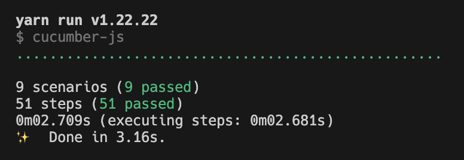

# CresDbg

CresDbg is a JavaScript and [Cucumber](https://cucumber.io/)-based test framework for Crestron SIMPL programs.



## Usage

### 1. Clone the repository

Click "Use this template" to create a new repository based on this one, or clone the repository directly.

#### To clone the repository directly:

```bash
git clone git@github.com:locimation/cresdbg.git
```

### 2. Write tests in plain English using [Gherkin syntax](https://cucumber.io/docs/gherkin/reference).

Tests should appear in the `features/` directory.
Do not modify the step definitions in the `features/steps/` directory.

Each feature file must have a `Background` section that sets the IP address, username, and password of the control processor (see below).

There are three valid step types that can be used to set the test stimulus:

1. `Given "my_digital_signal" set to 1 for 50 ms`
3. `Given "my_analog_signal" set to 50`
3. `Given "my_serial_signal" set to "Hello, world!"`

> Note: the `for 50ms` part of the first step is optional. If omitted, the signal will be set indefinitely.

There are then two valid step type that can be used to check the test response:

1. `Then "my_digital_or_analog_signal" should be 1`
2. `Then "my_serial_signal" should be "Hello, world!"`

#### Example:

```gherkin
# features/interlock.feature

Feature: Crestron Test Demo

    Background:
        Given a control processor at "192.168.0.10"
        And a username of "crestron"
        And a password of "password"

    Scenario: Interlock
        Given "interlock1_ps" set to 1 for 50 ms
        Then "interlock1_fb" should be 1
        And "interlock2_fb" should be 0
        And "interlock2_fb" should be 0

```

A compherensive sample test has been provided in the `features/sample.feature` file.

> Remember to remove this file before running your tests!

### 2. Run the tests using the "test" command.

```
yarn test
yarn run v1.22.22
$ cucumber-js
....

1 scenarios (1 passed)
4 steps (4 passed)
0m02.692s (executing steps: 0m02.666s)
✨  Done in 3.54s.
